# 🚌 Bus, Station, Route, and Ticket Management — OOP

## 🧩 Short Description
This project is an object-oriented programming (OOP) application that manages a city’s buses, routes, passengers, and tickets.  
The application allows the administration of urban and interurban buses, route management (stops), ticket purchasing, and report generation.

## 🏙️ Classes and Attributes

### 📌 Classes and Descriptions

---

### **City**
- **Attributes:**
  - `obj_buses` → vector of `City_Bus` and `Intercity_Bus` (for polymorphism)
- **Methods:**
  - `add_city_bus(std::string,std::string,int,int, std::vector<std::string>)`
  - `show_city_buses()`
  - `look_for_city_route(std::string,std::string)`
  - `add_intercity_bus(std::string,std::string,double,std::string,int,int,std::vector<std::string>)`
  - `show_intercity_buses()`
  - `look_for_intercity_route(std::string destination)`
  - `return_bus(int)`
  - Destructor `~City()`

---

### **Bus**
- **Attributes:**
  - `type` – bus type (1 = city, 2 = intercity)
- **Methods:**
  - Constructor `Bus(int)`
  - `virtual bool available()`
  - `virtual void available_places()`
  - `virtual void tickets_sold()`
  - `virtual void add_ticket()`
  - `virtual void report()`
  - `virtual bool is_in_route(std::string)`
  - `virtual bool is_in_route(std::string, std::string)`
  - `virtual std::string return_no_of_bus()`
  - `virtual void show_route()`
  - `virtual void express_line()`
  - `virtual void time_of_travel()`
  - Virtual Destructor `~Bus()`

---

### **City_Bus** *(inherits Bus)*
- **Attributes:**
  - `no_bus`
  - `taken`
  - `capacity`
  - `type_of_line`
  - `obj_route`
- **Methods:**
  - Constructor `City_Bus(int,std::string,std::string,int,int,std::vector<std::string> stops)`
  - `available()`
  - `available_places()`
  - `tickets_sold()`
  - `add_ticket()`
  - `report()`
  - `is_in_route(std::string, std::string)`
  - `return_no_of_bus()`
  - `show_route()`
  - `express_line()`
  - Destructor `~City_Bus()`

---

### **Interurban_Bus** *(inherits Bus)*
- **Attributes:**
  - `no_bus`
  - `taken`
  - `capacity`
  - `departure_city`
  - `destination_city`
  - `time`
  - `obj_route`
- **Methods:**
  - Constructor `Intercity_Bus(std::string,std::string,double,std::string,int,int,std::vector<std::string>)`
  - `available()`
  - `available_places()`
  - `tickets_sold()`
  - `add_ticket()`
  - `report()`
  - `is_in_route(std::string)`
  - `return_no_of_bus()`
  - `show_route()`
  - `time_of_travel()`
  - Destructor `~Intercity_Bus()`

---

### **Route**
- **Attributes:**
  - `stops` → vector of strings
- **Methods:**
  - Constructor `Route(std::vector<std::string>)`
  - `void show_stops()`
  - `void no_of_stops()`
  - `bool is_in_route(std::string)`

---

### **Ticket**
- **Attributes:**
  - `obj_bus` → pointer to `Urban_Bus` or `Interurban_Bus`
  - `date` → struct `Date { int day, month, year; }`
  - `price`
- **Methods:**
  - Constructor for urban and interurban buses `Ticket(Bus*,int,int,int,double)`
  - `void info_ticket()`

---

### **Passenger**
- **Attributes:**
  - `name`
  - `email`
  - `tickets` → vector of pointers to `Ticket`
- **Methods:**
  - Constructor `Passenger(std::string,std::string)`
  - `void show_tickets_bought()`
  - `void buy_ticket(Bus*,int,int,int,double)`
  - Destructor `~Passenger()`

---

### 📊 Class Relationships Diagram

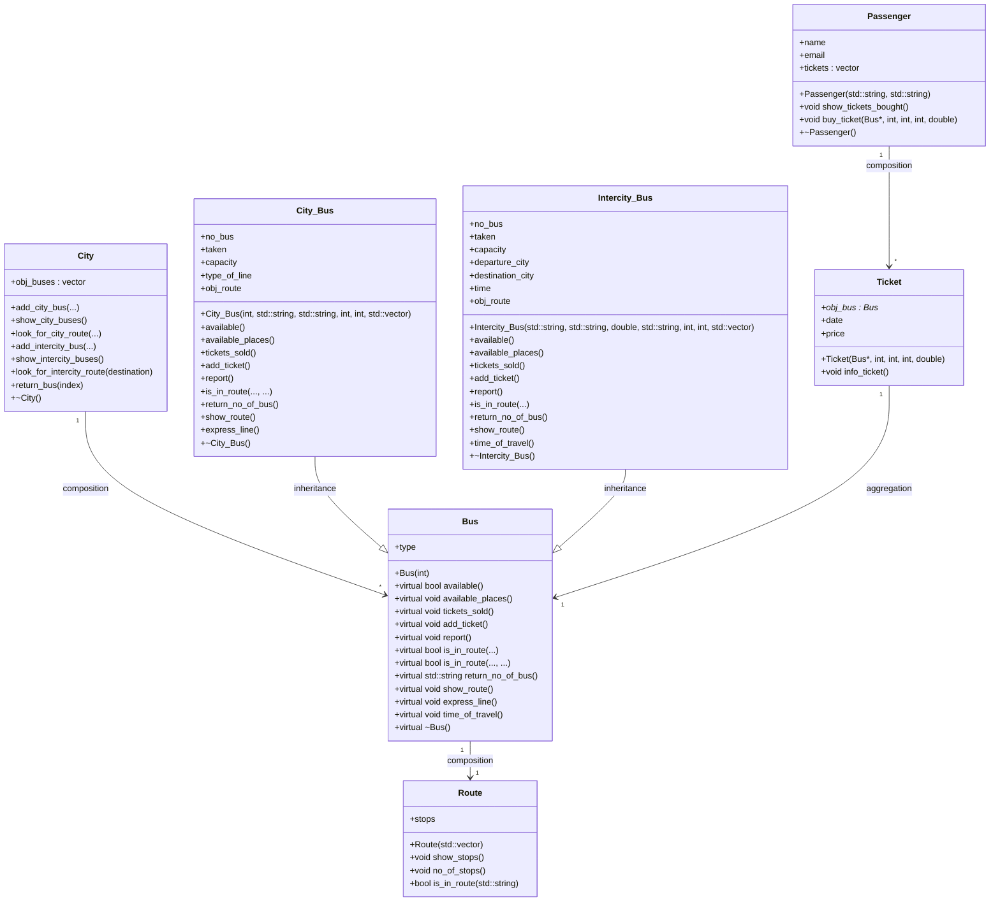

## 🔄Initializing the Classes and Selecting the City

The functions that handle this process are called ``` initialize_city ``` and ``` get_user_info ```.
They are used to initialize City and Passenger objects and to select the city for which the application will run.

### Step-by-step explanation of the city initialization function:

#### 1. Choosing the file used for initialization

The function receives the city and an index representing the file to read from.
The file is selected based on this index.

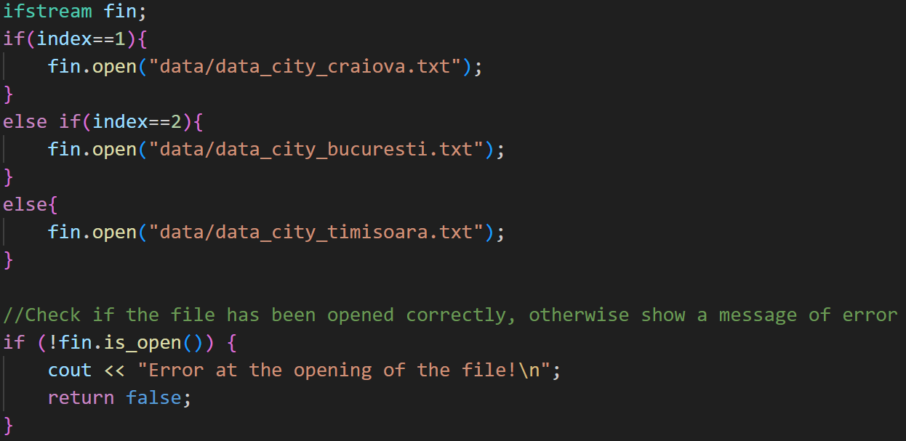

#### 2. Creating city buses

The number of urban buses is read, followed by reading all necessary data to create ``` City_Bus ``` objects.
These objects are added to the city through a vector of ``` Bus ``` objects, achieving composition and polymorphism.

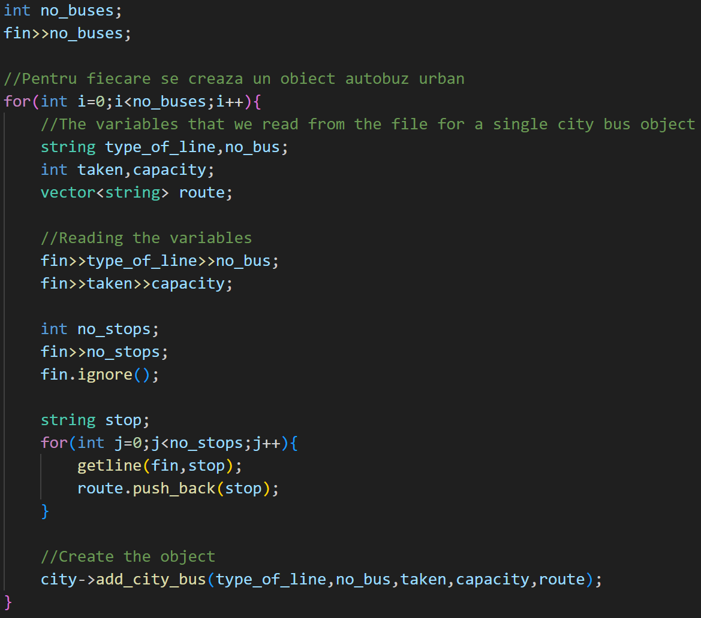

#### 3. Creating intercity buses

The number of interurban buses is read, and all required data is used to create ``` Intercity_Bus ``` objects.
These are also added to the city through the ``` Bus ``` vector, ensuring composition and polymorphism.

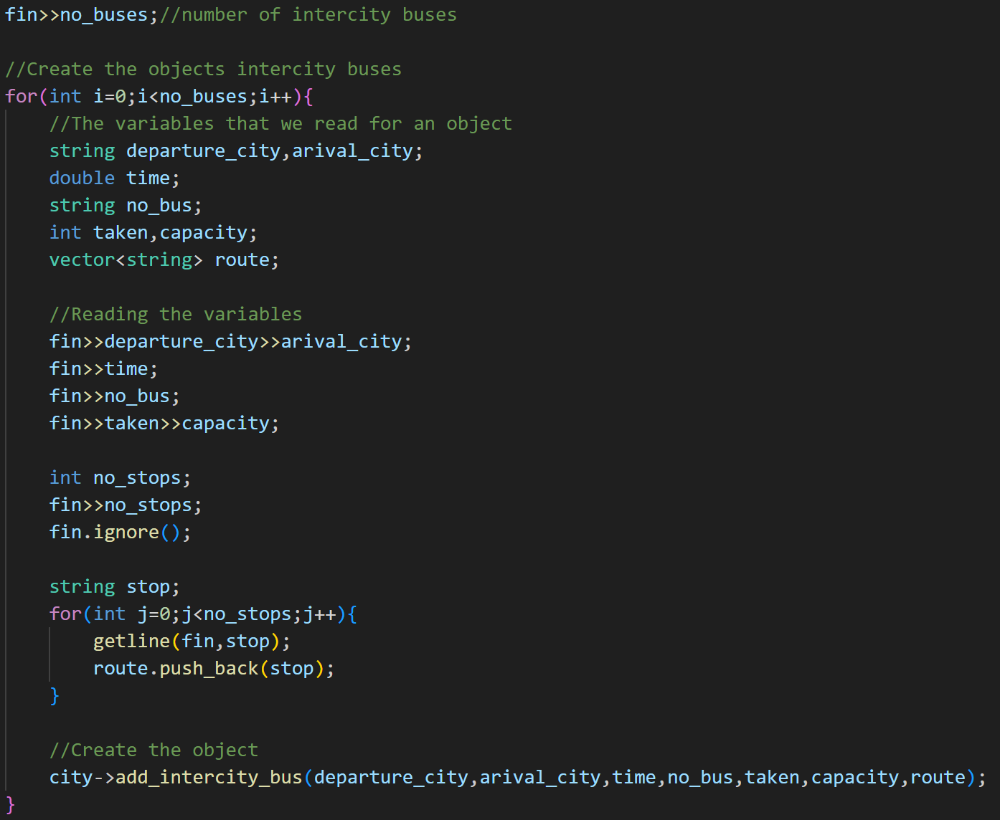

#### 4. Closing the input file

After all data has been read, the file is closed.

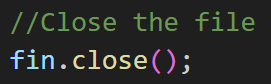

### Step-by-step explanation of the function that initializes the passenger and selects the city:

#### 1. User information (name and email)

This part collects the user’s name and email, which are then passed to main, where the ``` Passenger ``` object is created.


#### 2. City selection

The city is selected using an index (Craiova = 1, Bucharest = 2, Timișoara = 3).
Input validation ensures that only allowed values are accepted.

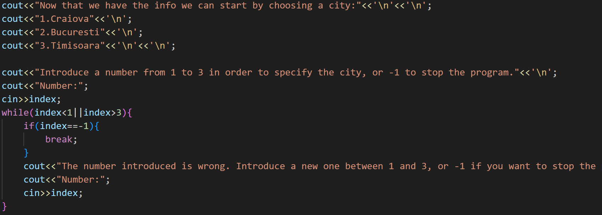

## 🚦Application Flow

This section presents the ``` app ``` function, which runs the application and connects all user-available operations.

#### 1. Application functionality menu

All available functionalities are displayed, and input validation ensures that only valid options can be selected.

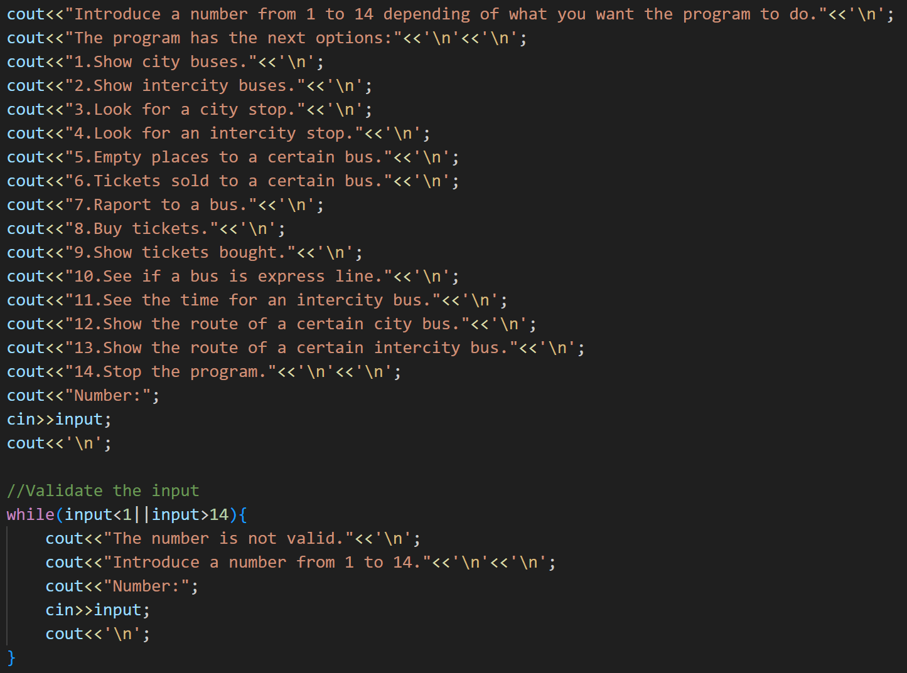

#### 2. Functionalities that require no additional output

These functionalities only require calling a method, possibly with parameters, without additional displays.

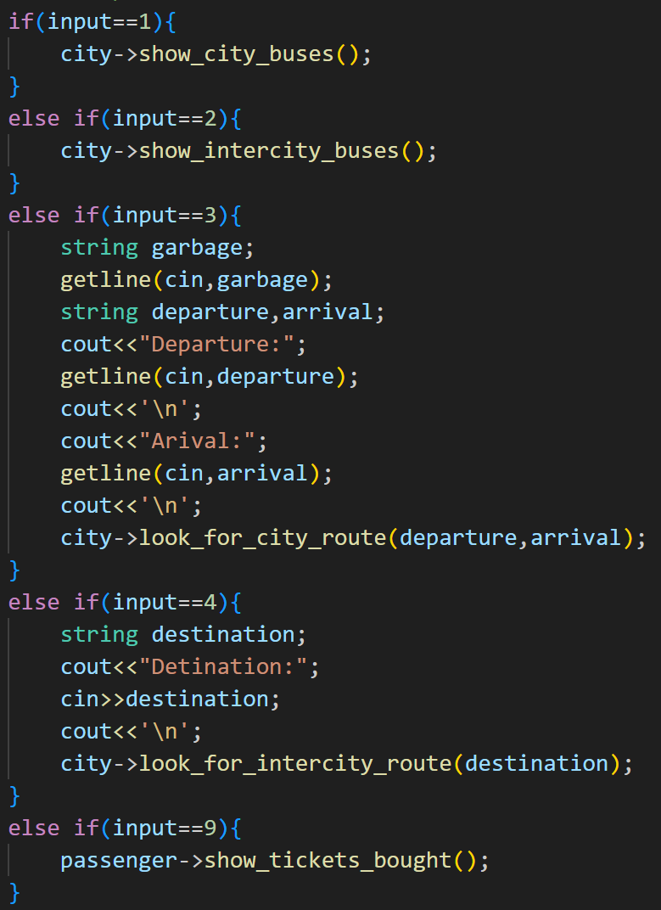

#### 3. Functionalities that require displaying buses for selection

These operations require displaying available buses so the user can choose one.

<div style="display: flex; flex-wrap:wrap; justify-content: center; align-items: center; gap: 20px;">
    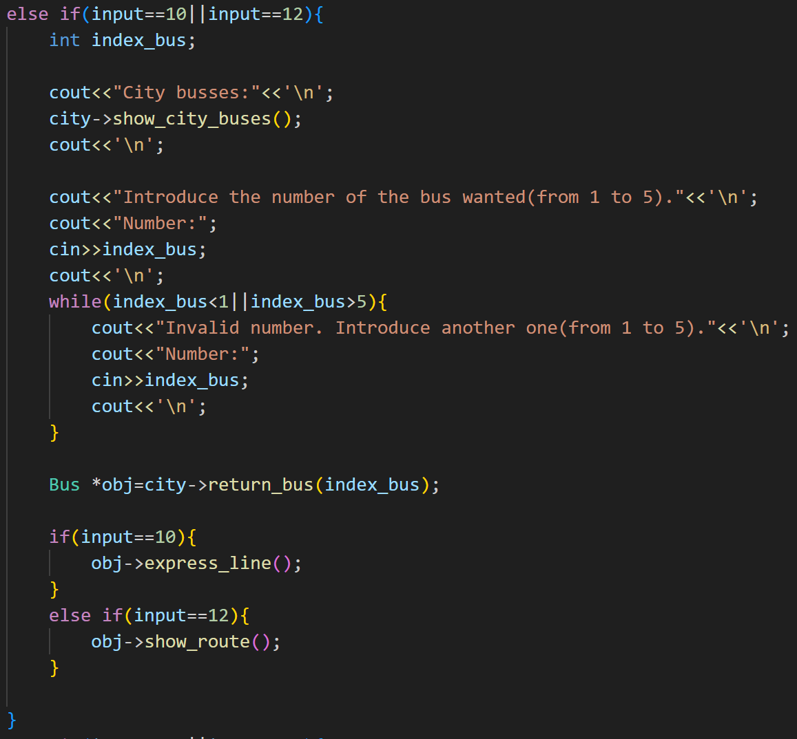
    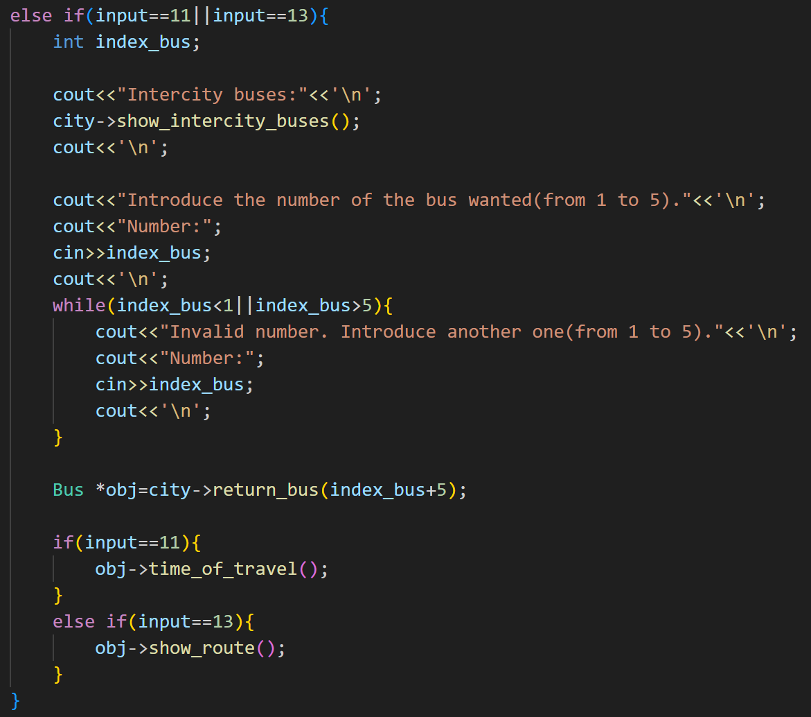
</div>

#### 4. Functionalities that require detailed selection

These operations require both bus selection and bus type selection.
This applies to functionalities 5, 6, 7, and 8.

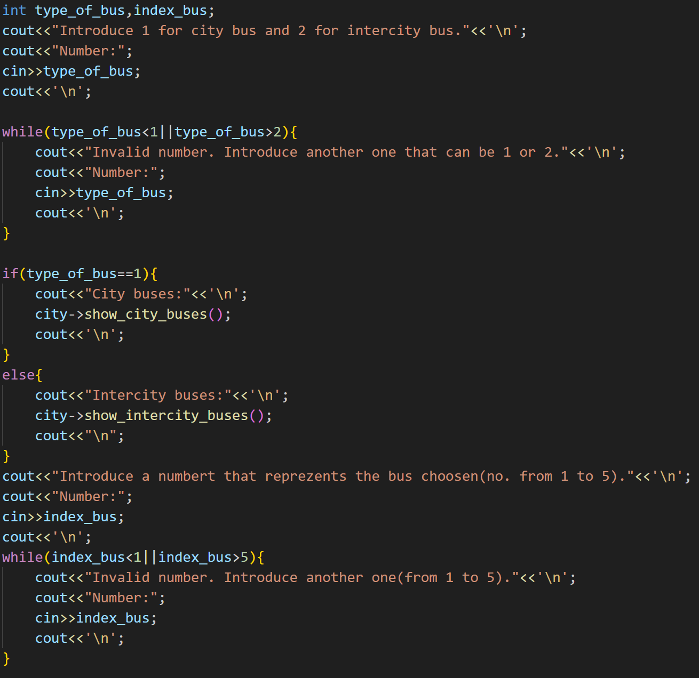

## 💻How to run it on your own machine:

### Steps to run the program in VS Code:

1. Copy the repository.

2. Use the following command to build the executable (already built, so this step can be skipped)

```

g++ src/*.cpp -I include -o build/program.exe

```

3. Run the executable from the command prompt:

```

build\program.exe

```

## ✅Conclusion:

This project demonstrates the application of object-oriented programming principles to manage a complex urban and interurban transportation system. By using classes, inheritance, composition, and aggregation, the application enables structured and efficient management of buses, routes, and tickets. The implemented functionalities—such as ticket purchasing, route display, and report generation—provide a coherent and intuitive workflow for users.
